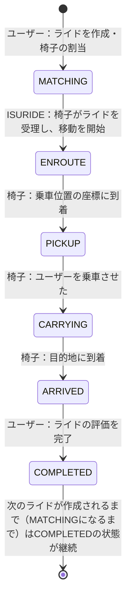

# ISURIDE アプリケーションマニュアル

<!-- TODO（公開前）: リンクの張り替え -->
[ISUCON14 当日マニュアル](./manual.md)も合わせて確認してください。

## ISURIDEとは
「電車での移動は大変…」「自家用車は駐車場代が高い…」そんなあなたにおすすめな全く新しいライドチェアサービスがISURIDEです。

ISURIDEはアプリで呼んだ椅子に座り、自動運転で目的地まで移動できるサービスです。
昨今、持続可能な社会を目指すためシェアリングエコノミーへの注目が高まっています。
また、自動運転という新たなビジネスモデルは交通事故の削減や、交通渋滞の緩和なども期待されています。

ISURIDEでは、チェアオーナーが提供する椅子をユーザーがアプリから配車リクエスト、目的地を入力して、マッチングが完了するとすぐに椅子が到着します。

利用後のライド評価システムを活用し、ユーザー・チェアオーナーともに満足度の高いライドチェアサービスを実現していきます。

利用エリアも続々拡大中！
オトクな招待キャンペーンも実施中！
今なら新規登録でますますお得に！

## 用語
### 地域（region）
- ISURIDEがサービス提供されている架空の世界に存在する、離れた2つの地域（チェアタウン・コシカケシティ）です。
- 地域およびその郊外を含めて、碁盤の目のように区画され道が整備されています。

### 距離（distance）と座標（coordinate）
- ISURIDEでの距離は、マンハッタン距離（直線距離ではなく、縦横の差の合計）で計算されます。
- 地図における座標は `latitude` と `longitude` で表されます。
  - 注：架空の世界なので、緯度が±90度を超えることがあります。軽度も±180度を超えることがあります。

### ユーザー（user）
- ISURIDEアプリを利用して実際に移動する人です。
- ユーザーは在住している地域内での移動を目的としてISURIDEを利用します。

### 椅子（chair）
- ユーザーを載せて移動する自律運転式の椅子です。
- 椅子はISURIDEアプリを通じてユーザーに配車されます。
- 椅子には移動速度の異なるモデルが複数存在します。ユーザーの待機時間や全体としての流動性を考慮して割り当てを行うことが望ましいです。
- 椅子は自律運転で移動しますが、必ずしも最短の経路で移動するわけではありません。
- 椅子は正しく位置履歴を記録するため、位置情報を更新するリクエストが成功したことを確認するまで次の移動を行いません。

### オーナー（owner）
- ISURIDEで椅子を運用している企業・個人です。
- 椅子を運用することで収益を上げることを目的としています。
- オーナーは定期的に自分の管理している椅子の収益を確認し、十分に収益を上げられていることを確認すると更なる椅子の導入を検討します。

### ライド（ride）
- ユーザーがISURIDEアプリを通じて椅子を呼び出し、椅子に乗り移動後、評価を行うまでの一連の流れのことを指します。
- ユーザーは自分が行ったライドが　`COMPLETED` になるまで他のライドを行うことができません。
- 椅子は自分に割り当てられたライドが `COMPLETED` になるまで他のライドを受けることができません。
- `COMPLETED` に遷移する際、ユーザーはそのrideに対して評価を行います。
  - この評価はユーザーの口コミに影響を与えるため、高い評価はユーザー数の増加に繋がります。
  - 評価には以下のような項目が関係していることが知られています。
    - 配車を依頼してから実際に椅子が割り当てられるまでの時間
    - 割り当てられた椅子が乗車位置に早く到着しそうかどうか（乗車位置に近い椅子が割り当てられていたり、遠くても速い椅子が割り当てられている場合が好ましい）
    - 椅子が割り当てられてから、ユーザーが乗車できるまでの時間
    - ユーザーが乗車してから目的地に到着するまでの時間

ライドは、 `MATCHING`, `ENROUTE`, `PICKUP`, `CARRYING`, `ARRIVED`, `COMPLETED` の6つの状態を持ちます。

それぞれの状態は以下のように遷移します。



## 通知エンドポイント
ISURIDEではクライアントに配車状態の変化を通知するための2つのエンドポイントが実装されています。
- ユーザー向け通知： `/api/app/notification`
- 椅子向け通知： `/api/chair/notification`

これらはリファレンス実装では通常のJSONレスポンスを返すエンドポイントですが、[SSE(Server-Sent Events)](https://developer.mozilla.org/ja/docs/Web/API/Server-sent_events/Using_server-sent_events)を利用してリアルタイム通知を実装することも可能です。
どちらの実装においても、状態変更から3秒以内に通知されていることが期待されます。

### JSONレスポンス
- サーバーがJSONレスポンスを返す場合、クライアントはポーリングによって配車状態の変化を取得します。
- Content-Typeは `application/json` です。
- クライアントはレスポンスの `retry_after_ms` で指定された時間後に再度リクエストを送信します。
  - リファレンス実装では30ms後に再度リクエストを送信するようになっています。

### SSE(Server-Sent Events)
- サーバーがSSEを利用してリアルタイム通知を行う場合、クライアントはSSEストリームから配車状態の変化を取得します。
- Content-Typeは `text/event-stream` です。
- 通知メッセージは `data: ` に続けて、webappディレクトリに存在するopenapi.yamlの `components.schemas.UserNotificationData` または `components.schemas.ChairNotificationData` のJSON文字列を返します。
  - これはJSONレスポンスの `data` に相当します。
  - 通知メッセージは1行で記述し、最後に改行を入れる必要があります。
  - 実際のレスポンス例は以下を参照してください。
- サーバーは接続後即座にその時送信するべき最新の配車状態を送信しなければなりません
- その後は随時最新の配車状態を送信します。
  - 状態が変わった時のみ即座に送信することが望ましいです。

以下はSSEでの通知レスポンスの例です。

#### ユーザー向け通知
```
data: {"ride_id":"01JEG4X2TZSE169T99XERS990M","pickup_coordinate":{"latitude":0,"longitude":0},"destination_coordinate":{"latitude":20,"longitude":20},"fare":1500,"status":"ENROUTE","chair":{"id":"01JDFEF7MGXXCJKW1MNJXPA77A","name":"QC-L13-8361","model":"クエストチェア Lite","stats":{"total_rides_count":1,"total_evaluation_avg":5}},"created_at":1733561322336,"updated_at":1733561322690}

data: {"ride_id":"01JEG4X2TZSE169T99XERS990M","pickup_coordinate":{"latitude":0,"longitude":0},"destination_coordinate":{"latitude":20,"longitude":20},"fare":1500,"status":"PICKUP","chair":{"id":"01JDFEF7MGXXCJKW1MNJXPA77A","name":"QC-L13-8361","model":"クエストチェア Lite","stats":{"total_rides_count":1,"total_evaluation_avg":5}},"created_at":1733561322336,"updated_at":1733561322690}

data: {"ride_id":"01JEG4X2TZSE169T99XERS990M","pickup_coordinate":{"latitude":0,"longitude":0},"destination_coordinate":{"latitude":20,"longitude":20},"fare":1500,"status":"CARRYING","chair":{"id":"01JDFEF7MGXXCJKW1MNJXPA77A","name":"QC-L13-8361","model":"クエストチェア Lite","stats":{"total_rides_count":1,"total_evaluation_avg":5}},"created_at":1733561322336,"updated_at":1733561322690}

data: {"ride_id":"01JEG4X2TZSE169T99XERS990M","pickup_coordinate":{"latitude":0,"longitude":0},"destination_coordinate":{"latitude":20,"longitude":20},"fare":1500,"status":"CARRYING","chair":{"id":"01JDFEF7MGXXCJKW1MNJXPA77A","name":"QC-L13-8361","model":"クエストチェア Lite","stats":{"total_rides_count":1,"total_evaluation_avg":5}},"created_at":1733561322336,"updated_at":1733561322690}

data: {"ride_id":"01JEG4X2TZSE169T99XERS990M","pickup_coordinate":{"latitude":0,"longitude":0},"destination_coordinate":{"latitude":20,"longitude":20},"fare":1500,"status":"CARRYING","chair":{"id":"01JDFEF7MGXXCJKW1MNJXPA77A","name":"QC-L13-8361","model":"クエストチェア Lite","stats":{"total_rides_count":1,"total_evaluation_avg":5}},"created_at":1733561322336,"updated_at":1733561322690}

data: {"ride_id":"01JEG4X2TZSE169T99XERS990M","pickup_coordinate":{"latitude":0,"longitude":0},"destination_coordinate":{"latitude":20,"longitude":20},"fare":1500,"status":"CARRYING","chair":{"id":"01JDFEF7MGXXCJKW1MNJXPA77A","name":"QC-L13-8361","model":"クエストチェア Lite","stats":{"total_rides_count":1,"total_evaluation_avg":5}},"created_at":1733561322336,"updated_at":1733561322690}

data: {"ride_id":"01JEG4X2TZSE169T99XERS990M","pickup_coordinate":{"latitude":0,"longitude":0},"destination_coordinate":{"latitude":20,"longitude":20},"fare":1500,"status":"ARRIVED","chair":{"id":"01JDFEF7MGXXCJKW1MNJXPA77A","name":"QC-L13-8361","model":"クエストチェア Lite","stats":{"total_rides_count":1,"total_evaluation_avg":5}},"created_at":1733561322336,"updated_at":1733561322690}

data: {"ride_id":"01JEG4X2TZSE169T99XERS990M","pickup_coordinate":{"latitude":0,"longitude":0},"destination_coordinate":{"latitude":20,"longitude":20},"fare":1500,"status":"COMPLETED","chair":{"id":"01JDFEF7MGXXCJKW1MNJXPA77A","name":"QC-L13-8361","model":"クエストチェア Lite","stats":{"total_rides_count":2,"total_evaluation_avg":4.5}},"created_at":1733561322336,"updated_at":1733561370916}

data: {"ride_id":"01JEG4X2TZSE169T99XERS990M","pickup_coordinate":{"latitude":0,"longitude":0},"destination_coordinate":{"latitude":20,"longitude":20},"fare":1500,"status":"COMPLETED","chair":{"id":"01JDFEF7MGXXCJKW1MNJXPA77A","name":"QC-L13-8361","model":"クエストチェア Lite","stats":{"total_rides_count":2,"total_evaluation_avg":4.5}},"created_at":1733561322336,"updated_at":1733561370916}

data: {"ride_id":"01JEG4X2TZSE169T99XERS990M","pickup_coordinate":{"latitude":0,"longitude":0},"destination_coordinate":{"latitude":20,"longitude":20},"fare":1500,"status":"COMPLETED","chair":{"id":"01JDFEF7MGXXCJKW1MNJXPA77A","name":"QC-L13-8361","model":"クエストチェア Lite","stats":{"total_rides_count":2,"total_evaluation_avg":4.5}},"created_at":1733561322336,"updated_at":1733561370916}

data: {"ride_id":"01JEG4X2TZSE169T99XERS990M","pickup_coordinate":{"latitude":0,"longitude":0},"destination_coordinate":{"latitude":20,"longitude":20},"fare":1500,"status":"COMPLETED","chair":{"id":"01JDFEF7MGXXCJKW1MNJXPA77A","name":"QC-L13-8361","model":"クエストチェア Lite","stats":{"total_rides_count":2,"total_evaluation_avg":4.5}},"created_at":1733561322336,"updated_at":1733561370916}

```

#### 椅子向け通知
```plaintext
data: {"ride_id":"01JEG4X2TZSE169T99XERS990M","user":{"id":"01JEG4W4E1QF0ZA1YY4BYGA1M5","name":"CON ISU"},"pickup_coordinate":{"latitude":0,"longitude":0},"destination_coordinate":{"latitude":20,"longitude":20},"status":"MATCHING"}

data: {"ride_id":"01JEG4X2TZSE169T99XERS990M","user":{"id":"01JEG4W4E1QF0ZA1YY4BYGA1M5","name":"CON ISU"},"pickup_coordinate":{"latitude":0,"longitude":0},"destination_coordinate":{"latitude":20,"longitude":20},"status":"ENROUTE"}

data: {"ride_id":"01JEG4X2TZSE169T99XERS990M","user":{"id":"01JEG4W4E1QF0ZA1YY4BYGA1M5","name":"CON ISU"},"pickup_coordinate":{"latitude":0,"longitude":0},"destination_coordinate":{"latitude":20,"longitude":20},"status":"PICKUP"}

data: {"ride_id":"01JEG4X2TZSE169T99XERS990M","user":{"id":"01JEG4W4E1QF0ZA1YY4BYGA1M5","name":"CON ISU"},"pickup_coordinate":{"latitude":0,"longitude":0},"destination_coordinate":{"latitude":20,"longitude":20},"status":"CARRYING"}

data: {"ride_id":"01JEG4X2TZSE169T99XERS990M","user":{"id":"01JEG4W4E1QF0ZA1YY4BYGA1M5","name":"CON ISU"},"pickup_coordinate":{"latitude":0,"longitude":0},"destination_coordinate":{"latitude":20,"longitude":20},"status":"ARRIVED"}

data: {"ride_id":"01JEG4X2TZSE169T99XERS990M","user":{"id":"01JEG4W4E1QF0ZA1YY4BYGA1M5","name":"CON ISU"},"pickup_coordinate":{"latitude":0,"longitude":0},"destination_coordinate":{"latitude":20,"longitude":20},"status":"COMPLETED"}
```

### 通知の順序
どちらの通知もクライアントに対しては発生したすべての状態遷移を発生した順序通りに少なくとも1回以上（at least once）返す必要があります。

例えばユーザーがライドAを作成し椅子が割り当てられ椅子が乗車位置に到着したあと初めて通知エンドポイントにリクエストした場合を考えます。
この時、ライドAは`MATCHING` → `ENROUTE` → `PICKUP` の順で状態が遷移しているため、クライアントには下記順序で通知を返す必要があります。
- 1回目：ライドA:`MATCHING`
- 2回目：ライドA:`ENROUTE`
- 3回目：ライドA:`PICKUP`

同様にライドAで目的地に到着し、評価を行った後にライドBを作成したあと通知エンドポイントにリクエストした場合、クライアントには下記順序で通知を返す必要があります。
- 1回目：ライドA:`ARRIVED`
- 2回目：ライドA:`COMPLETED`
- 3回目：ライドB:`MATCHING`
- 4回目：ライドB:`ENROUTE`

## ライドのマッチング
リファレンス実装では `isuride-matcher` というsystemdサービスが `GET /api/internal/matching` を500msごとにポーリングすることでライドと椅子のマッチングを行っています。
以下の手順でマッチング間隔を変更することができます。

1. `/home/isucon/env.sh` を編集し、`ISUCON_MATCHING_INTERVAL` の値を変更します。
2. `sudo systemctl restart isuride-matcher.service` でサービスを再起動します。

## 決済マイクロサービス
ISURIDEを利用して目的地に到着した際、ユーザーは椅子の利用料金を支払う必要があります。
この支払い処理は社内の決済マイクロサービスを使用していますが、現在そのインフラが不安定なためリクエストが集中すると決済処理の途中でサーバーからのレスポンスが失われる可能性があります。
そのためリファレンス実装ではリクエストが失敗した場合は支払履歴を確認し、支払処理が完了していないことを確認した場合にはリクエストをリトライする実装となっています。
ただし既に支払い処理が開始されている場合、後述する`Idempotency-Key`ヘッダを使用せずにリトライを行うと、複数回の支払いが発生しエラーとなります。
<!-- TODO: APIについては /path/to/openapi.yaml を参照する旨を記載 -->

### Idempotency-Key ヘッダを利用したリクエストの重複防止
決済マイクロサービスでは、`Idempotency-Key`ヘッダを利用して決済の重複を防ぐことができます。
リクエストヘッダに`Idempotency-Key`というキーで、リクエストを一意に識別するための値を指定することで、同じ`Idempotency-Key`ヘッダを持つリクエストが複数回送信されたとしても冪等に処理されます。

### 決済マイクロサービスモックについて
ISURIDEの開発に利用できる決済マイクロサービスのモックとして、選手に提供される各サーバーのポート12345番でHTTPサーバーが起動しています。
このモックサーバーは以下の制約を持っています。

- 決済トークンはどんなものでも受け入れる
- 決済処理は常に成功する

決済マイクロサービスモックを停止または再起動する場合は以下のコマンドを利用してください。

```sh
sudo systemctl stop isuride-payment_mock.service
sudo systemctl restart isuride-payment_mock.service
```

なお、負荷走行後に決済マイクロサービスモックを利用する際は、下記のように `POST /api/initialize` で決済サーバーエンドポイントを再設定してください。

```sh
curl -H 'content-type: application/json' https://isuride.xiv.isucon.net/api/initialize -d '{"payment_server": "http://localhost:12345"}'
```


## アプリケーションの概要

ISURIDEでは、利用者が使用するクライアントアプリケーション、椅子のオーナーが使用するオーナーアプリケーション、選手が動作確認を行うためのシミュレーターの3つが準備されています。

### (1) クライアントアプリケーション (/client)

クライアントアプリケーションは、ISURIDE利用者が利用することを想定した、モバイル端末向けのWebアプリケーションです。
<https://isuride.xiv.isucon.net>にアクセスし、`Client Application`ボタンから遷移できます。

- ログイン後、目的地と現在位置を設定して、ISURIDEボタンを押下することで配車を行うことができます。
- このアプリケーション単体では、椅子が動作、完全な動作を確認することはできません。（確認の用途には、シミュレーターを利用してください）

### (2) シミュレーター (/simulator)

シミュレーターは、[アカウントプリセット](#アカウントプリセット)に記載の椅子を利用し、選手が椅子の動作を確認するためのアプリケーションです。
<https://isuride.xiv.isucon.net>にアクセスし、`Simulator Application`ボタンから遷移できます。


#### ① クライアント画面
- `クライアント (/client)`で利用できるアプリケーションを左側に表示しています。

#### ② 椅子の基本設定
- 初期状態では1脚の椅子が操作可能になっており、この部分から椅子の状態の確認や設定を行うことができます。
- このコンポーネントは上から椅子の名前、椅子のモデル名、ライドの状態、椅子の現在位置設定ボタン、進捗インジケーターで構成されています。
- 「椅子の位置ボタン」を押下し、椅子の現在位置を任意に設定できます。
- 「進捗インジケーター」では、ライドの進捗をシミュレートして表示しています。黒いピンは`ユーザーの待機位置`を表し、赤いピンは`目的地`を表します。

#### ③ 配車受け付け状態の設定
- シミュレーターで動作する椅子の配車受付状態(activity)を切り替えることができます。

#### ④ 擬似椅子の表示設定
- クライアントアプリケーション上に架空の椅子のデータを表示し、現実で稼働した状態の表示に近づけるための設定です。
- 動作イメージをわかりやすくするもので、表示される椅子はデータベース上にないものも表示されます。

#### シミュレーターの注意事項
- クライアント画面でISURIDEボタンを押下してライドを出すと、シミュレーターは1秒置きに椅子の状態を変更して、配車完了(`COMPLETED`)まで、椅子の動きを擬似的にシミュレートします。
- **シミュレーターは特定の椅子のデータを利用して動作するため、複数のシミュレーターを起動して同時に操作すると予期せぬ挙動になることがあります。**
- **シミュレーターで操作する椅子以外の椅子が配車受付状態になっていると、正常に動作しません。そのため、シミュレーターは初期状態での確認をおすすめします。**
- マッチング状態のまま動作しない問題等が発生した場合は、初期化処理を行なってください。

### (3) オーナーアプリケーション (/owner)

オーナーアプリケーションは、ISURIDEのオーナーが利用することを想定した、デスクトップ端末向けのWebアプリケーションです。
<https://isuride.xiv.isucon.net>にアクセスし、`Owner Application`ボタンから遷移できます。

- ログイン後、オーナーが管理している椅子の一覧を確認することができます。
- 売上のタブに切り替えることで、椅子別、モデル別の売り上げ情報を一覧して確認することができます。

### アカウントプリセット

初期データにあらかじめ組み込まれているアカウントの一覧を示します。

#### 利用者一覧

| 利用者名    | sessionToken                     |
| ----------- | -------------------------------- |
| Collier6283 | 34ea320039fc61ae2558176607a2e12c |
| Miller6106  | d175bd9d34b9c4e0b3d9864a07ccee37 |
| Goldner6682 | d1c9df78002d6829f32f1d676c472de1 |

#### オーナー一覧

| オーナー名         | sessionToken                     |
| ------------------ | -------------------------------- |
| Seat Revival       | 7188f2fb45c7d81a6ba30d1572cfff37 |
| 快座製作所         | 001d0876c1197819935c6f2e32eb0320 |
| 匠椅子製作所       | 0811617de5c97aea5ddb433f085c3d1e |
| つくる椅子株式会社 | c3eb38a254ca73e84b4d01158870a06d |
| NextStep Cab       | 3585ccc78c507660a4802973d269849e |

#### シミュレーターで利用する椅子

| 椅子名      | モデル名            | オーナー名 | sessionToken                     |
| ----------- | ------------------- | ---------- | -------------------------------- |
| QC-L13-8361 | クエストチェア Lite | 快座製作所 | 3013d5ec84e1b230f913a17d71ef27c8 |
